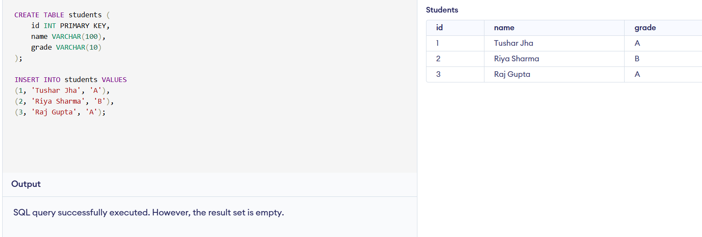
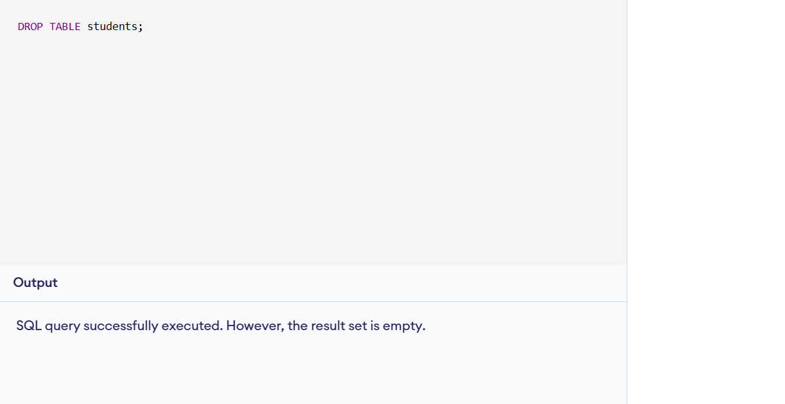
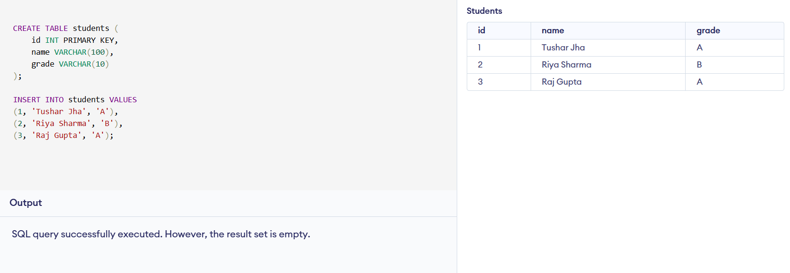

# DATABASE-BACKUP-AND-RECOVERY

*COMPANY NAME*: CODTECH IT SOLUTIONS

*NAME*: TUSHAR JHA

*INTERN ID*: CT04DM1383

*DOMAIN*: SQL

*DURATION*: 4 WEEKS

*MENTOR*:  NEELA SANTOSH

#  Internship Task 4: Database Backup and Recovery

##  Objective
Demonstrate how to take a backup of a database and restore it in case of failure.

---

##  Files Included

| File Name              | Description                            |
|------------------------|----------------------------------------|
| `create_students.sql`  | Initial database creation and data     |
| `backup_students.sql`  | Backup SQL script                      |
| `simulate_failure.sql` | Script to simulate data loss           |
| `restore_students.sql` | Restore database from backup           |
| `before_backup.png`    | Screenshot before backup (optional)    |
| `after_deletion.png`   | Screenshot after deletion (optional)   |
| `after_restore.png`    | Screenshot after restore (optional)    |

---

##  Process Summary

1. Created a `students` table with 3 records.
2. Took backup by exporting the SQL structure and data.
3. Simulated failure by dropping the table.
4. Restored the database using the backup script.
5. Verified data and structure successfully recovered.

---

##  Tools Used

- MySQL / Online DB Editor (https://www.db-fiddle.com/)
- GitHub for code hosting

---

##  Output (Optional)

**Before Backup**  

**After Deletion**  

**After Restore**  

